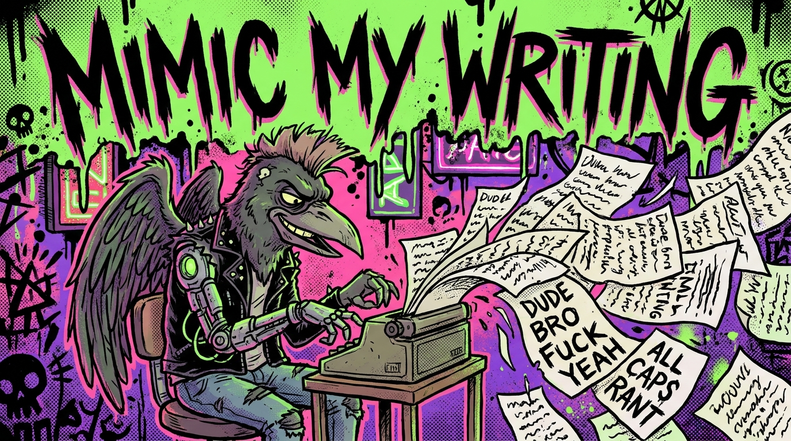

<p align="center">
  
</p>

<h1 align="center">mimic-my-writing</h1>

<p align="center">
  <b>Force AI to write like YOU do.</b><br>
  Stop sounding like ChatGPT. Stop the "it's not just X, it's Y" garbage.<br>
  Feed in your writing samples → get a voice fingerprint → AI drafts in your actual voice.
</p>

<p align="center">
  <a href="https://clawhub.ai/skills/chchchadzilla/mimic-my-writing"></a>
  <a href="https://github.com/chchchadzilla/mimic-my-writing/blob/main/SKILL.md"></a>
</p>

---

## The problem

You ask an AI to write you a blog post, an email, a LinkedIn rant. What comes back sounds like every other AI-written thing on the internet:

> *"In today's rapidly evolving landscape, it's crucial to delve into the multifaceted tapestry of considerations. It's not just about writing — it's about crafting experiences that resonate."*

Garbage. That's not how YOU talk. You'd never say "tapestry." You curse. You use double-dashes instead of em dashes. You drop ALL CAPS for emphasis on real stress words. You start sentences with "Dude" and end with "you know what I mean?"

**mimic-my-writing forces the AI to write like that.** Like YOU.

---

## How it works (in 3 steps)

### 1. You give it samples

Drop a few markdown or txt files of YOUR writing into a folder. Blog posts, rants, Slack messages, emails — anything that sounds like you. Three samples is enough to start.

### 2. It fingerprints your voice

The skill runs `analyze_voice.py` on your samples and produces a JSON fingerprint capturing:

- **Sentence burstiness** — do you mix 4-word punches with 30-word ramblers? (humans = high; AI = monotone)
- **Punctuation habits** — em-dash vs double-dash, comma density, exclamation rate
- **ALL CAPS frequency** — how often you SHOUT for emphasis
- **Profanity rate** — what you cuss, and how often
- **Signature phrases** — your repeated 2 and 3-word combos ("you know what I mean", "watch me bitch")
- **Sentence openers** — how you start things
- **Markdown habits** — bold/italic density, header style
- **Vocabulary fingerprint** — your distinctive words via TF-IDF vs generic English

### 3. The AI uses it as a hard constraint

When you ask the AI to write something "in your voice," it loads the fingerprint, follows the voice card, and runs a de-slop pass to kill any AI tells that snuck in. The output sounds like you wrote it.

---

## Install (for non-technical folks)

> If you don't have OpenClaw yet: [https://docs.openclaw.ai/start/getting-started](https://docs.openclaw.ai/start/getting-started)

### Step 1 — Open your terminal

- **Mac:** Press `Cmd + Space`, type "Terminal," hit Enter.
- **Windows:** Press the Windows key, type "PowerShell," hit Enter.
- **Linux:** You already know.

### Step 2 — Install the skill

Copy this exactly and paste it in:

```bash
openclaw skills install mimic-my-writing
```

You should see `✓ Installed mimic-my-writing`.

### Step 3 — Verify it loaded

```bash
openclaw skills list
```

You should see `mimic-my-writing` in the list.

### Step 4 — Add YOUR writing samples

In your OpenClaw workspace folder (usually `~/.openclaw/workspace` or wherever you set up OpenClaw), create the samples folder:

```bash
mkdir -p ~/.openclaw/workspace/samples/me
```

Then drop **3 or more** of your own writing files into that folder. They should be `.md` or `.txt`. Examples of what to use:

- A blog post you wrote
- A long rant you posted somewhere
- An email where you really sounded like yourself
- A Discord/Slack message thread you wrote in

The more samples the better. **Don't put short stuff** (under 200 words is too thin). **Don't put samples written by someone else** — only YOUR words.

### Step 5 — Use it

Start a new OpenClaw session. Just ask:

- *"Use mimic-my-writing to fingerprint my samples in `samples/me/`"*
- *"Now draft a LinkedIn post about [topic] in my voice"*
- *"Rewrite this email in my voice"*
- *"Grade how well this draft matches my voice"*

The AI will run the fingerprint, generate the voice card, and write the draft following YOUR style.

---

## What's in the box

| Path | What it is |
|---|---|
| `SKILL.md` | The skill definition + workflow |
| `scripts/analyze_voice.py` | The fingerprint extractor (pure Python, no installs needed) |
| `references/fingerprint.md` | How to read the JSON fingerprint |
| `references/anti-ai-tells.md` | The slop kill-list (banned words, banned phrases) |
| `references/workflow.md` | Step-by-step usage patterns (cold draft, warm draft, hybrid, critique) |
| `samples/chad/` | Sample writing samples (the maintainer's own voice) as a working demo |
| `fingerprints/chad.json` | Demo fingerprint showing what the output looks like |
| `assets/banner.jpg` | This README's banner |

---

## Try the demo

Want to see what a finished fingerprint looks like before you make your own? Check out [`fingerprints/chad.json`](fingerprints/chad.json) — that's a real fingerprint produced from the sample files in `samples/chad/`. Burstiness around 0.95, profanity ~7/1000 words, signature phrases like "you know what I mean" and "screw up" — that's what a strong voice looks like in numbers.

---

## Pairs well with

- 🚔 **[slop-cop](https://github.com/chchchadzilla/slop-cop)** — visual QA cousin that kills AI-generated image slop
- 🧹 **ai-humanizer** (bundled with OpenClaw) — the general-purpose AI-tropes scrubber

---

## Links

- 🌐 **ClawHub:** [https://clawhub.ai/skills/chchchadzilla/mimic-my-writing](https://clawhub.ai/skills/chchchadzilla/mimic-my-writing)
- 🐙 **GitHub:** [https://github.com/chchchadzilla/mimic-my-writing](https://github.com/chchchadzilla/mimic-my-writing)
- 📜 **License:** MIT

---

<p align="center">
  <i>Built by <a href="https://github.com/chchchadzilla">@chchchadzilla</a> with crow-energy assist from José 🐦‍⬛</i>
</p>
